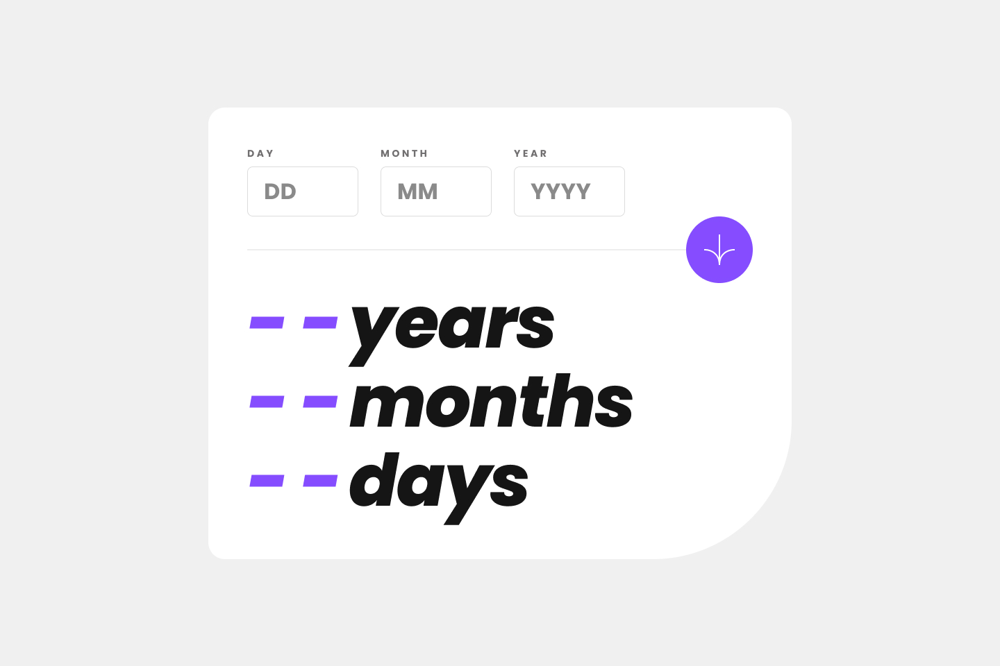

# Frontend Mentor - Age calculator app solution

This is a solution to the [Age calculator app challenge on Frontend Mentor](https://www.frontendmentor.io/challenges/age-calculator-app-dF9DFFpj-Q). Frontend Mentor challenges help you improve your coding skills by building realistic projects.

## Table of contents

- [Overview](#overview)
  - [The challenge](#the-challenge)
  - [Screenshot](#screenshot)
  - [Links](#links)
- [My process](#my-process)
  - [Built with](#built-with)
  - [What I learned](#what-i-learned)
  - [Continued development](#continued-development)
  - [Useful resources](#useful-resources)
- [Author](#author)
- [Acknowledgments](#acknowledgments)

## Overview

### The challenge

Users should be able to:

- View an age in years, months, and days after submitting a valid date through the form
- Receive validation errors if:
  - Any field is empty when the form is submitted
  - The day number is not between 1-31
  - The month number is not between 1-12
  - The year is in the future
  - The date is invalid e.g. 31/04/1991 (there are 30 days in April)
- View the optimal layout for the interface depending on their device's screen size
- See hover and focus states for all interactive elements on the page
- **Bonus**: See the age numbers animate to their final number when the form is submitted

### Screenshot



### Links

- Solution URL: [Age Calculator](https://agee-calculatorr.netlify.app/)
- Live Site URL: [Github Repo](https://github.com/anye-web/Age-Calculator)

## My process

### Built with

- Semantic HTML5 markup
- CSS custom properties
- Flexbox
- CSS Grid
- Mobile-first workflow
- Use Vanilla Javascript for client site validation

### What I learned

In this project, i learned a lot about using CSS media queries and the benefits of using rem over px for responsive web design. Additionally, i gained experience in working with dates and extracting data from them.

Here are my top picks..

```html
<h1>Some HTML code I'm proud of</h1>
```

```css
.proud-of-this-css {
  html {
    font-size: 62.5%;
  }
}
```

```js
const proudOfThisFunc = () => {
  // Getting the number of days in a month.
  const daysInMonth = (year, month) => new Date(year, month, 0).getDate();
};
```

### Continued development

As a result of this project, I am inspired to continue focusing on responsive design with CSS, and further improve my skills in writing clean and readable JavaScript code. Additionally, I am eager to explore ways to increase reusability in my code, making it more efficient and maintainable. I believe that these areas of focus will enable me to create more user-friendly and accessible websites and applications, and I am excited to continue learning and growing in these areas.

### Useful resources

- [30 seconds of Code](https://www.30secondsofcode.org/) - This helped me in writting the Js code above. I really liked this pattern and will use it going forward.

## Author

- Twitter - [Anye Jr](twitter.com/frujunior2)
- Frontend Mentor - [@anye-web](https://www.frontendmentor.io/profile/anye-web)

## Acknowledgments

I want to give a special thanks to Frontend Mentor for providing this challenge. This project has not only allowed me to apply and expand my knowledge in CSS, but also revisit some of the concepts I learned in my JavaScript course. The provided resources and guidelines have been instrumental in guiding me throughout the project and helping me achieve my goals. I am grateful for this opportunity and look forward to participating in future challenges.
